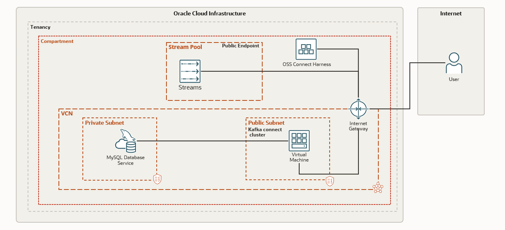

# oci-oss-cdc-mysql-debezium

Change Data Capture [CDC] is a technique to capture changes to the data in a DB via events and push these events to a middleware. This solution will showcase this by using OSS as the middleware and Debezium Mysql connector along with Apache Kafka Connect.


## Prerequisites

- Permission to `manage` the following types of resources
    - VCNS, InternetGateways, RouteTables, Subnets
    - Compute Instances
    - Stream Pools
    - Streams
    - Connect Harness
    - Mysql

- Quota to create the above resources.

If you don't have the required permissions and quota, contact your tenancy administrator. See [Policy Reference](https://docs.cloud.oracle.com/en-us/iaas/Content/Identity/Reference/policyreference.htm), [Service Limits](https://docs.cloud.oracle.com/en-us/iaas/Content/General/Concepts/servicelimits.htm), [Compartment Quotas](https://docs.cloud.oracle.com/iaas/Content/General/Concepts/resourcequotas.htm).

## Deploy Using Oracle Resource Manager

1. Click [](https://cloud.oracle.com/resourcemanager/stacks/create?region=home&zipUrl=https://github.com/nitsoni/oci-oss-cdc-mysql-debezium/releases/latest/download/oci-oss-cdc-mysql-debezium-latest.zip)

    If you aren't already signed in, when prompted, enter the tenancy and user credentials.

2. Review and accept the terms and conditions.

3. Select the region where you want to deploy the stack.

4. Follow the on-screen prompts and instructions to create the stack.

5. After creating the stack, click **Terraform Actions**, and select **Plan**.

6. Wait for the job to be completed, and review the plan.

    To make any changes, return to the Stack Details page, click **Edit Stack**, and make the required changes. Then, run the **Plan** action again.

7. If no further changes are necessary, return to the Stack Details page, click **Terraform Actions**, and select **Apply**. 


## Deploy Using the Terraform CLI

### Clone the Module
Now, you'll want a local copy of this repo. You can make that with the commands:

    git clone https://github.com/nitsoni/oci-oss-cdc-mysql-debezium
    cd oci-oss-cdc-mysql-debezium
    ls

### Set Up and Configure Terraform

1. Complete the prerequisites described [here](https://github.com/cloud-partners/oci-prerequisites).

2. Create a `terraform.tfvars` file, and specify the following variables:

```
# Authentication
tenancy_ocid         = "<tenancy_ocid>"
current_user_ocid    = "<user_ocid>"
fingerprint          = "<finger_print>"
private_key_path     = "<pem_private_key_path>"

# Region
region = "<oci_region>"

# Compartment
compartment_ocid = "<compartment_ocid>"

````

### Create the Resources
Run the following commands:

    terraform init
    terraform plan
    terraform apply

### Destroy the Deployment
When you no longer need the deployment, you can run this command to destroy the resources:

    terraform destroy


## Post Deployment
Once the resources are deployed either through CLI or through resource manager run the following commands on the instance. (Use the pricate key generated to login tot he instance)
- Start the kafka connect. Configuration file has allready been created as part of deployment.
- Start the Debezium mysql connector. Connector configuration is also generated as part of deployemnt.
- Create the sample employee DB. Sample scripts allready copied.

```
nohup ./kafka/bin/connect-distributed.sh connect-distributed.properties >> connect.logs &
curl -i -X POST -H "Accept:application/json" -H "Content-Type:application/json" localhost:8083/connectors/ -d @connector.json
cd test_db
mysql --host 10.0.1.3 -u <USER_NAME> --password=<PASSWORD> -t -f < employees.sql
````

## Quick Start Architecture 

> **_NOTE:_**  This setup is only for demonstration purpose. 




